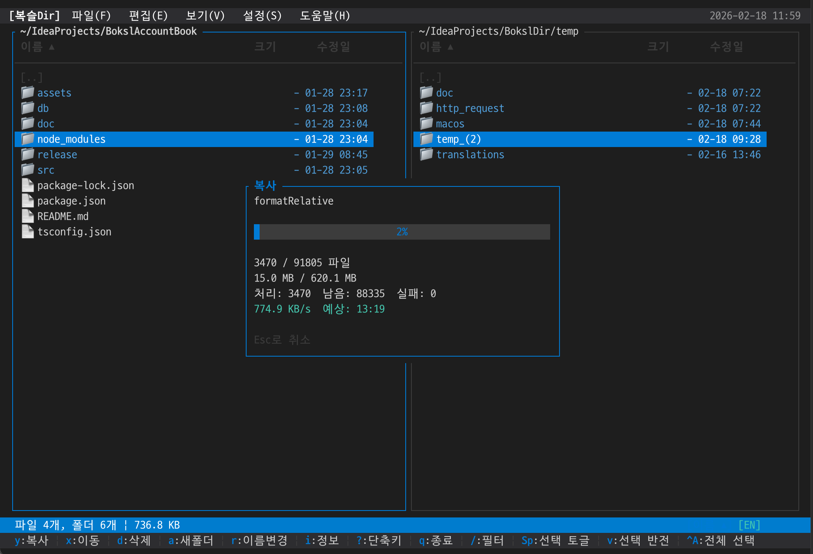

# 복슬Dir (Boksl Dir)

Rust로 작성된 터미널 기반 듀얼 패널 파일 매니저입니다.
키보드 중심으로 파일 탐색, 선택, 복사/이동/삭제 작업을 빠르게 수행할 수 있습니다.



## 주요 기능

- 듀얼 패널 파일 탐색 (`Tab`으로 활성 패널 전환)
- Vim/화살표 기반 이동 (`j/k/h/l`, `↑/↓`, `Enter`)
- 파일 작업: 복사(`y`), 이동(`x`), 삭제(`d`), 영구 삭제(`D`)
- 선택 기능: 개별 선택/전체 선택/선택 반전 (`Space`, `Ctrl+A`, `v`, `u`)
- 필터/정렬/숨김 파일 토글 (`/`, `s*`, `.`)
- 탭/히스토리/북마크 (`tn`, `tx`, `tt`, `th`, `tb`, `Ctrl+B`)
- 압축 작업 (`zc`, `zx`, `za`)
- 다크/라이트/고대비 테마, 한국어/영어 UI 전환

## 요구사항

- Rust (2021 edition)
- Unicode 및 컬러를 지원하는 터미널

## 설치 및 실행

```bash
# 저장소 클론
git clone https://github.com/setvect/BokslDir.git
cd BokslDir

# 개발 모드 실행
cargo run

# 릴리스 빌드 및 실행
cargo build --release
./target/release/boksldir
```

시작 경로를 지정하려면:

```bash
./target/release/boksldir .
./target/release/boksldir /tmp
```

시작 인자 동작:
- 인자 없음: 이전 종료 시점 히스토리 경로 복원
- 유효한 디렉토리 경로: 좌/우 패널 모두 해당 경로로 시작
- 유효하지 않은 경로: 인자 없음과 동일하게 동작

## 문서

- [사용자 매뉴얼](docs/User-Manual.md)
- [릴리즈 노트](RELEASE_NOTES.md)
- [Architecture](docs/Architecture.md)

## 개발 명령어

```bash
cargo fmt
cargo clippy --all-targets --all-features
cargo test
```

## 라이선스

MIT
