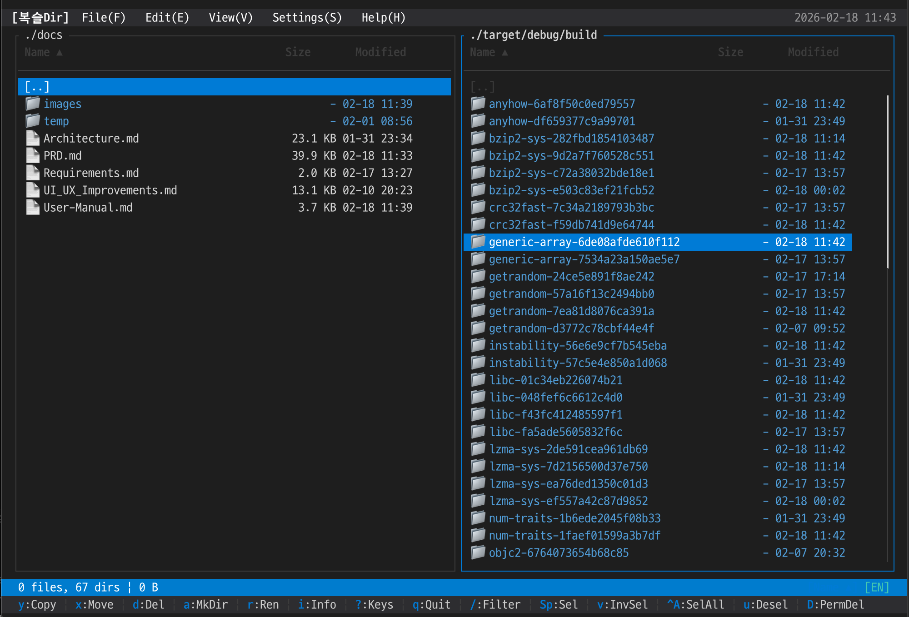
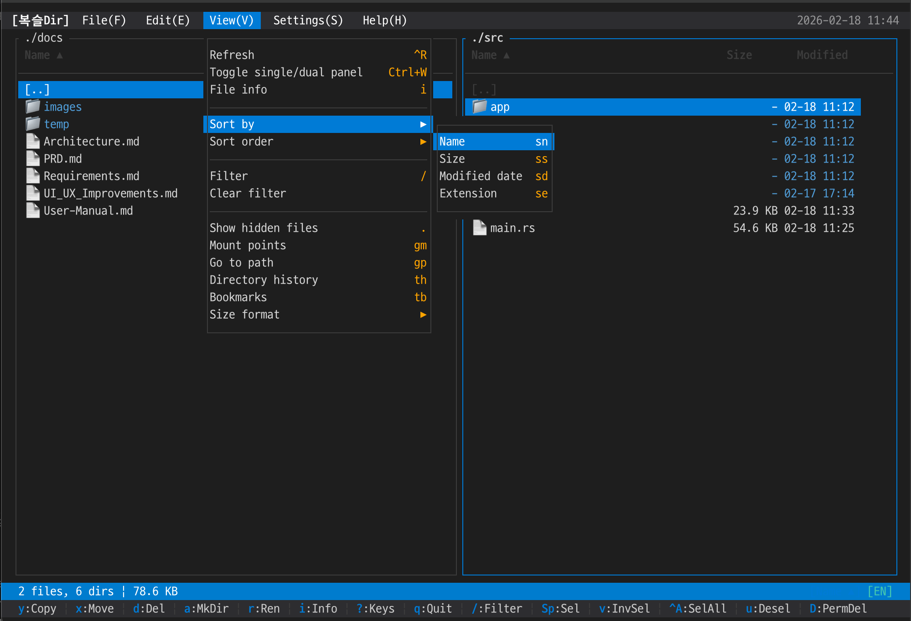
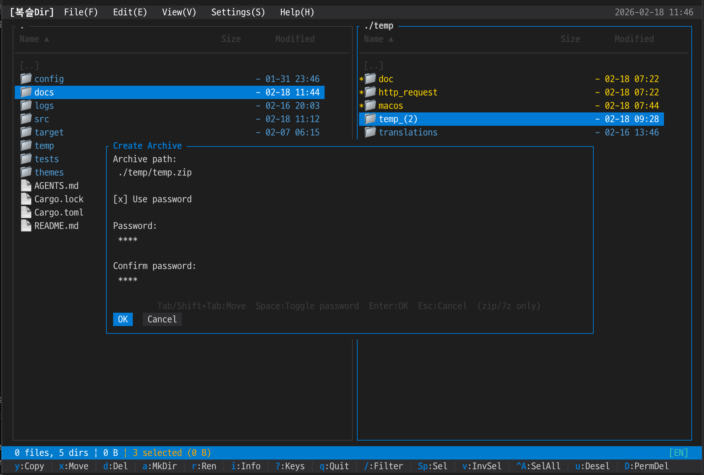
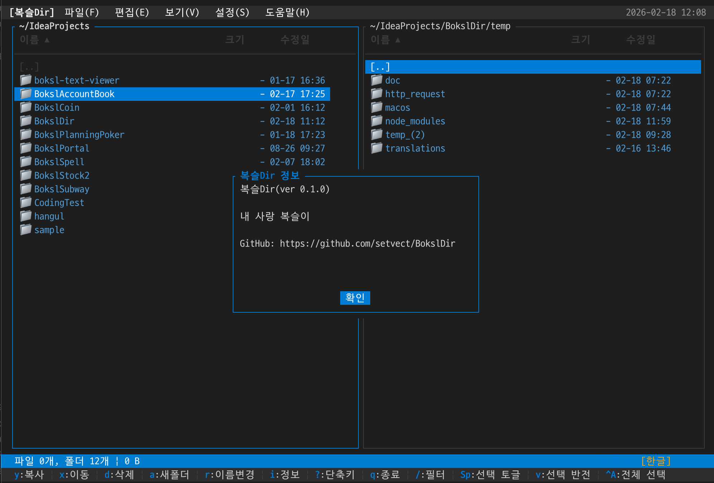

# 복슬Dir 사용자 매뉴얼

복슬Dir(Boksl Dir)는 터미널에서 사용하는 듀얼 패널 파일 매니저입니다. 키보드 중심으로 디렉토리 탐색, 파일 선택, 복사/이동/삭제 같은 작업을 빠르게 처리할 수 있도록 설계되었습니다.

기본 화면은 좌/우 2개 패널을 동시에 보여주며, 활성 패널 기준으로 작업이 실행됩니다. 터미널 크기가 너무 작으면 작업 화면 대신 경고 화면이 표시됩니다.

## 주요 기능

- 듀얼 패널 기반 파일 탐색 (`Tab`으로 활성 패널 전환)
- Vim/화살표 키 네비게이션 (`j/k/h/l`, `↑/↓`, `Enter`)
- 파일 작업: 복사, 이동, 삭제, 영구 삭제, 이름 변경, 새 폴더 생성
- 다중 선택 작업 (`Space`, `Ctrl+A`, `v`, `u`)
- 필터 검색 (`/`) 및 숨김 파일 토글 (`.`)
- 정렬 시퀀스 키 (`sn`, `ss`, `sd`, `se`, `sr`)
- 탭/히스토리/북마크 기능 (`tn`, `tx`, `tt`, `th`, `tb`, `Ctrl+B`)
- 도움말(`?`)과 메뉴(`F9`)를 통한 기능 탐색

## 주요 단축키

| 구분             | 키                               | 동작                               |
| ---------------- | -------------------------------- | ---------------------------------- |
| 종료             | `q`, `Ctrl+C`                    | 프로그램 종료                      |
| 패널 전환        | `Tab`                            | 활성 패널 전환                     |
| 메뉴             | `F9`                             | 상단 메뉴 열기                     |
| 도움말           | `?`                              | 단축키 도움말 열기                 |
| 아래/위 이동     | `j`/`k`, `↓`/`↑`                 | 항목 이동                          |
| 상위/진입        | `h`/`l`, `←`/`Enter`             | 상위 디렉토리 이동 / 디렉토리 진입 |
| 맨 위/맨 아래    | `gg`/`G`, `Home`/`End`           | 리스트 끝으로 이동                 |
| 페이지 이동      | `Ctrl+U`/`Ctrl+D`, `PgUp`/`PgDn` | 반 페이지 이동                     |
| 복사/이동        | `y`/`x`                          | 선택 항목 복사/이동                |
| 삭제/영구삭제    | `d`/`D`                          | 휴지통 삭제 / 영구 삭제            |
| 새 폴더/이름변경 | `a`/`r`                          | 디렉토리 생성 / 이름 변경          |
| 속성 보기        | `i`                              | 파일/디렉토리 속성 다이얼로그      |
| 선택 토글        | `Space`                          | 현재 항목 선택/해제                |
| 전체 선택/해제   | `Ctrl+A`/`u`                     | 전체 선택 / 전체 해제              |
| 선택 반전        | `v`                              | 선택 반전                          |
| 필터 시작        | `/`                              | 이름 필터 입력                     |
| 숨김 파일 토글   | `.`                              | 숨김 파일 표시/숨김 전환           |
| 새로고침         | `Ctrl+R`                         | 현재 패널 새로고침                 |
| 탭 관련          | `tn`, `tx`, `tt`                 | 탭 열기/닫기/목록                  |
| 히스토리         | `Alt+←`, `Alt+→`, `th`           | 뒤로/앞으로/히스토리 목록          |
| 북마크           | `Ctrl+B`, `tb`                   | 북마크 추가/목록                   |
| 아카이브         | `zc`, `zx`, `za`                 | 압축/해제/자동 해제                |

참고: 전체 단축키는 프로그램 내 `?` 도움말에서 확인할 수 있습니다.

## 주요 화면 스냅샷

아래 경로에 이미지 파일을 넣으면 문서에서 바로 표시됩니다.

### 1) 실행화면

### 2) 메뉴 화면 (`F9`)

### 3) 파일 복사

### 4) 압축하기

### 5) 복슬Dir 정보

## 사용 시 참고사항

- 권장 최소 터미널 크기: `80x24`
- 파일 작업은 활성 패널 기준으로 수행됩니다.
- 한글 입력/표시는 터미널 환경 및 IME 상태의 영향을 받을 수 있습니다.
